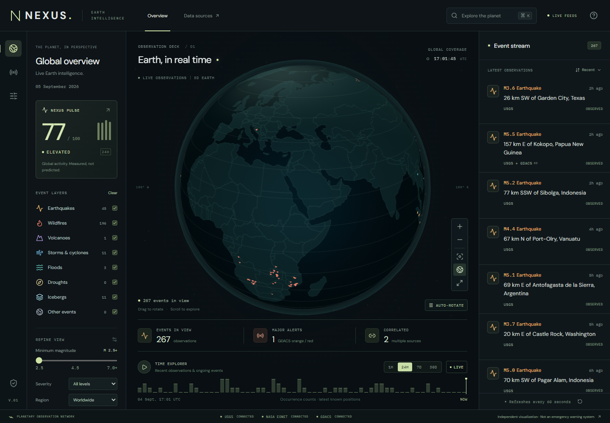

# NEXUS

**Watch the planet happen.** An independent Live Earth Intelligence Platform built with real public data, an interactive Three.js Earth, and a deliberately restrained observation workspace.

NEXUS is a functioning application, not a static dashboard. It fetches public feeds through server-side adapters, validates observations, correlates independent earthquake reports, calculates an explainable activity index, and lets you explore events and country indicators.

**No API keys. No paid APIs. No LLM calls. No database required. No production mock data.** NEXUS is not an official emergency-warning system. Use local authorities and originating agencies for emergency guidance.



## Run locally

Requires Node.js 22.18 or later and npm. A current desktop browser with WebGL2 is recommended for the globe. The event stream, filters, search, and country panels remain available without WebGL.

```bash
npm ci
npm run dev
```

Open [localhost:3000](http://localhost:3000). On Windows PowerShell with script execution disabled, use `npm.cmd` instead of `npm`. The server needs outbound HTTPS access to the public data sources; no environment variables or credentials are required.

The home page introduces the observatory with a cinematic Earth and a timestamped public-feed snapshot. Open `/live` to go straight to the existing workspace. Event links from the home page open the corresponding observation when it is still in the source catalog.

Use **Share current view** in the workspace header to copy a link containing filters, globe position, country context and time selection. Live links refresh normally. Replay links retain the saved time but query the current source catalog; they are not immutable historical archives. Links require no account or server storage.

For a production build:

```bash
npm run build
npm start
```

## Explore

- Drag Earth to rotate; use scroll/pinch or the zoom buttons. Select a marker to inspect it. Click a mapped country to open country intelligence. Earth reset returns to the starting orientation.
- Event layers, minimum earthquake magnitude, severity, region, and search affect the globe and stream together. All underlying records remain available in the stream even when the globe uses representative markers.
- Open search with **Ctrl/Cmd + K**. Search a country or event title, or run deterministic commands: `M6+`, `Earthquakes`, `Volcanoes`, `Last 24 hours`, `Last 7 days`, `Last 30 days`.
- The time explorer supports 1 hour, 24 hours, 7 days, and 30 days. Drag the timeline, play the sequence, or return to Live. The histogram shows event occurrence counts.
- Click Pulse to inspect its components and methodology. Open Data sources to see successful fetch times, rejected entries, coverage, and connection health.
- On mobile, use Earth, Events, Filters, and Search in the bottom navigation. Events and filters use sheets; Pulse remains accessible beside the Earth heading.

## Architecture

```text
USGS / NASA EONET / GDACS       World Bank
           ↓                        ↓
Independent validated adapters   Indicator adapter
           ↓                        ↓
Bounded cache + request deduplication + stale fallback
           ↓                        ↓
Country attribution → earthquake correlation
           ↓                        ↓
Unified observations + Pulse     Country indicators
           ↓                        ↓
GET /api/events               GET /api/countries/:code
           ↓                        ↓
React workspace → filters / time explorer / detail panels
           ↓
Three.js Earth: local cartography, instanced markers, picking
```

The main modules are:

- `src/lib/adapters.ts`: runtime schemas and source normalization. Malformed or unsupported entries are skipped individually; an entirely malformed nonempty response fails the source.
- `src/lib/cache.ts`: independent TTLs, concurrent-request coalescing, a failure retry delay, bounded stale retention, and HTTP timeouts. Only successfully validated data is cached.
- `src/lib/correlation.ts`: conservative cross-source matching with a stable USGS earthquake identity and preserved provenance.
- `src/lib/pulse.ts`: the documented activity-index algorithm.
- `src/lib/filters.ts`: shared filtering and deterministic command parsing.
- `src/lib/countries.ts`: country registry and conservative source-text attribution.
- `src/lib/worldbank.ts`: validated latest nonempty indicators, preserving each reporting year.
- `src/components/Globe.tsx`: Three.js rendering, geometry-based country selection, marker picking and level of detail. The renderer is loaded in its own client bundle.
- `src/components/Workspace.tsx`: orchestration and workspace controls; event/country details, dialogs, and methodology are separate components.

React state is sufficient for this MVP. There is no additional state-management library. The visual system uses custom CSS and locally served open-license fonts. Three.js is used directly rather than adding React Three Fiber or globe.gl: the scene needs a small number of persistent objects and instanced marker batches, and direct control makes cleanup, camera movement, and picking explicit.

## Sources and coverage

**USGS:** [M2.5+ rolling month GeoJSON](https://earthquake.usgs.gov/earthquakes/feed/v1.0/summary/2.5_month.geojson), with [format documentation](https://earthquake.usgs.gov/earthquakes/feed/v1.0/geojson.php). Includes magnitude, origin time, latest revision, coordinates, depth, and official report URL. Non-earthquake records and missing magnitudes are excluded. The minimum magnitude is intentionally 2.5; this is not a complete microearthquake catalog.

**NASA EONET:** [v3 recent events](https://eonet.gsfc.nasa.gov/api/v3/events?status=all&days=30), with [API documentation](https://eonet.gsfc.nasa.gov/docs/v3). Includes open and closed catalog events returned for 30 days. Uses the earliest valid point observation as origin and the latest valid point as position. Polygon-only events are skipped; coordinates are never silently swapped or replaced with guessed centroids. NASA's open catalog state is not a guaranteed present-day physical status. Severity remains unclassified because EONET does not provide a comparable disaster severity scale.

**GDACS:** [public home GeoJSON](https://www.gdacs.org/contentdata/xml/gdacsAPP_Home.geojson), with the [official portal](https://www.gdacs.org/). Handles nested point coordinates, UTC dates without timezone suffixes, and official Green/Orange/Red alerts. The feed has uneven recent history; choosing 30 days does not manufacture missing GDACS history. GDACS alert colors map to low/high/critical UI tiers, while the original official alert remains visible. A feed entry alone is not interpreted as proof that an event is ongoing.

**World Bank:** [Indicators API](https://datahelpdesk.worldbank.org/knowledgebase/articles/898581-api-basic-call-structures), queried on country selection. Population (`SP.POP.TOTL`), GDP in current US dollars (`NY.GDP.MKTP.CD`), and GDP per capita in current US dollars (`NY.GDP.PCAP.CD`) use their latest nonempty annual observations. Values may have different years. Missing values are displayed as unavailable, never zero.

GDELT is intentionally outside the MVP. No feature depends on an unreliable media endpoint or an unimplemented integration.

## Normalization and provenance

`GlobalEvent` keeps canonical ID, event category, title, coordinates, origin/revision times, catalog state, activity tier, optional measurements, optional country attribution, contributing source records, and optional correlation evidence. Each contributor keeps its source ID, update time, report URL, and official alert when available.

Country codes come from source country names and recognized location suffixes, with explicit handling for US state abbreviations. Unassigned or offshore observations are not silently attached to the nearest country. Thus region filters and country counts are **incomplete subsets** of the loaded catalog, not authoritative national totals. Country clicking uses Natural Earth boundaries; these are simplified cartographic boundaries, not a legal boundary authority.

External links must be HTTPS and may not contain embedded credentials. API requests use fixed server-side destinations; country inputs must resolve to the local registry. External HTML is never rendered.

## Event correlation

Only earthquakes from different primary sources are eligible for automatic matching. Candidates must have known magnitudes and pass all hard gates:

- Same event type, with no source already shared between the pair.
- At most **80 km** apart, **3 minutes** apart, and **0.5 magnitude units** apart.
- No conflicting attributed countries when both are known.

The transparent score is:

```text
score = 0.45 × (1 − distanceKm / 80)
      + 0.40 × (1 − timeDifferenceMinutes / 3)
      + 0.15 × (1 − magnitudeDifference / 0.5)
```

Only scores of at least **0.75** are merged. The best eligible match is selected; USGS remains the measurement authority and canonical ID. Exact source-ID duplicates retain their newest revision. Same-source aftershocks are never merged. Nearby fires, storms, and floods are not merged without dependable identity evidence.

The UI's match percentage is **a heuristic score, not a probability or an official agency confidence rating**. Distance and time evidence are shown in the detail panel. This favors missed matches over false merges and does not claim complete disaster deduplication.

## NEXUS Global Pulse v1

Pulse is a descriptive activity index, not a risk score, prediction, trend relative to a baseline, or measure of danger to humanity. It is computed on the current unfiltered catalog with a rolling 24-hour earthquake window and relevant recent/open natural events. It stays independent of the user's filters and replay position.

Components are normalized to 0–100 before weighting:

1. **Seismic activity — 35%:** sum of `max(0, magnitude − 2)²` for earthquakes originating in the last 24 hours, normalized with `100 × log1p(sum) / log1p(1000)`, capped at 100. This is a descriptive magnitude proxy, not physical seismic energy.
2. **Disaster alerts — 30%:** recent GDACS contributions weighted 8 for critical, 4 for high, 1 for moderate, 0.25 for low, and 0 for unknown; logarithmically normalized against 100 and capped.
3. **Active natural events — 20%:** open EONET observations, logarithmically normalized against 300 and capped.
4. **Geographical spread — 15%:** occupied 30° latitude/longitude cells, normalized against 40 cells and capped.

The rounded weighted sum is 0–100. Labels are Quiet below 30, Moderate below 60, Elevated below 80, and High activity at 80 or above. The reference caps are heuristic constants, not fitted historical percentiles. Geographical cells are not equal-area.

Unavailable sources retain their weights; the score is labeled **Partial data**, with available-source coverage. Stale sources produce a **Stale data** label when coverage is otherwise complete. If every source is unavailable, the result is `null`, shown as a dash. Do not compare partial and complete scores as if their coverage were equal.

## Reliability and caching

- USGS: 60-second source TTL.
- NASA EONET and GDACS: 5-minute source TTL.
- All event sources: up to 1 hour of stale retention after expiry, with explicit stale status.
- World Bank: 7-day source TTL and 30-day stale retention.
- Upstream requests: 15-second timeout; failed loads back off for 60 seconds.
- Browser: a single event-polling loop every 60 seconds, paused while hidden or offline. Simultaneous server loads coalesce by source.
- Event responses allow a 30-second shared cache and 30-second stale-while-revalidate interval. Successful country responses allow longer shared caching.

The source cache is process-local and bounded. It does not survive restarts and is not shared between serverless instances. A long-running Node process gets the best reuse. CDN caching reduces requests on compatible deployments; a future shared cache or persistent history store can be added behind the existing data layer without changing the UI contract.

The monthly event response is gzip-compressed for supporting clients, with `Vary: Accept-Encoding`, to reduce transfer cost on hosts that do not compress dynamic responses automatically.

Source failures are logged server-side and reported with a calm health state. Healthy adapters continue independently. The application never inserts mock events or rebrands old data as a successful new fetch. Synthetic fixtures live only in `tests/`.

## Time exploration limitations

Earthquakes are filtered by **origin**, not latest revision. Other categories can match by recent observation or open catalog state. Replay excludes future origins and animates which events meet the chosen window. It uses **latest known positions and catalog state**, so it is not a reconstruction of what an agency knew historically. There are no historical storm tracks or immutable snapshots yet. The timeline histogram counts origins; long-running open events may appear on the globe without contributing a new histogram count.

## Performance and accessibility

Markers are batched with `InstancedMesh`, with no React component per marker. Above 1,000 visible events, the globe keeps a representative event per 2° cell and category, with a 1,500-marker cap plus a selected event. The stream retains the full filtered set and reveals additional rows in batches. The UI discloses representative-marker mode.

The globe uses locally generated 2K cartography, restrained shaders, capped pixel ratios, and lower mobile frame frequency. It pauses rendering in hidden tabs and disposes GPU resources on unmount. Reduced-motion preferences disable auto-rotation and pulse animation and make camera transitions immediate. Non-WebGL event navigation remains fully usable. Native dialogs provide keyboard focus containment and Escape behavior; inputs are labeled and controls have focus indicators.

Browser resource/frame measurements can be generated with `npm run audit:ui`. Headless results are environment-specific and are not a guarantee of mobile GPU performance. Automated accessibility checks supplement, rather than replace, manual keyboard and responsive review.

## Tests

```bash
npm test
npm run typecheck
npm run build
```

The unit suite covers normalization, malformed records, independent-source correlation, aftershocks, distance edge cases, safe URLs, country attribution, Pulse, filters, command parsing, cache coalescing, stale expiry, and transport errors.

With the app running and Google Chrome installed:

```bash
npm run test:e2e
npm run audit:ui
npm run check:live
```

Playwright tests intercept API responses with clearly synthetic test fixtures to exercise healthy, partial, empty, and failed states deterministically. `check:live` independently calls real public sources. `scripts/browser-check.mjs` exercises real data and saves desktop/mobile screenshots under `artifacts/`. Set `NEXUS_TEST_URL` to use a different running app URL. Tests require process-launch permissions in restricted environments.

The GitHub Actions workflow runs type generation/checking, unit tests, a production build, and browser tests against that production build. CI installs Playwright Chromium and sets `NEXUS_BROWSER_CHANNEL=chromium`; local tests default to installed Google Chrome.

## Deployment

Deploy as a standard Next.js Node application or on a host supporting Next.js route handlers. Run `npm ci`, `npm run build`, then `npm start`. The host must serve `public/` and permit outbound HTTPS. No secrets, database, paid tiles, or billing-enabled API account are needed. Static-export-only hosting such as plain GitHub Pages cannot run the API routes.

The code is compatible with small/free hosting allocations, but provider quotas, serverless cache lifetime, and egress limits still apply. This repository does not provision infrastructure or guarantee a hosting provider's pricing. API usage remains free of paid integrations. Before a high-traffic public launch, add deployment-level rate limiting and a shared cache appropriate to your host.

## Attribution

- [USGS](https://www.usgs.gov/), [NASA EONET](https://eonet.gsfc.nasa.gov/), [GDACS](https://www.gdacs.org/), and [World Bank](https://data.worldbank.org/) provide the underlying observations. NEXUS is independent and is not endorsed by these organizations.
- [Natural Earth](https://www.naturalearthdata.com/about/terms-of-use/) public-domain cartography, distributed through `world-atlas`, supplies country boundaries. `world-countries` supplies country metadata; its package license is ODbL 1.0. See `THIRD_PARTY_NOTICES.md`.
- Three.js (MIT), D3 Geo (ISC), Lucide (ISC), React (MIT), Next.js (MIT), and Zod (MIT) support rendering and validation.
- DM Sans and IBM Plex Mono are open fonts served locally through Fontsource packages under the SIL Open Font License.

To regenerate bundled geography after updating the source packages, run `node scripts/prepare-geography.mjs` and inspect the resulting data changes.
